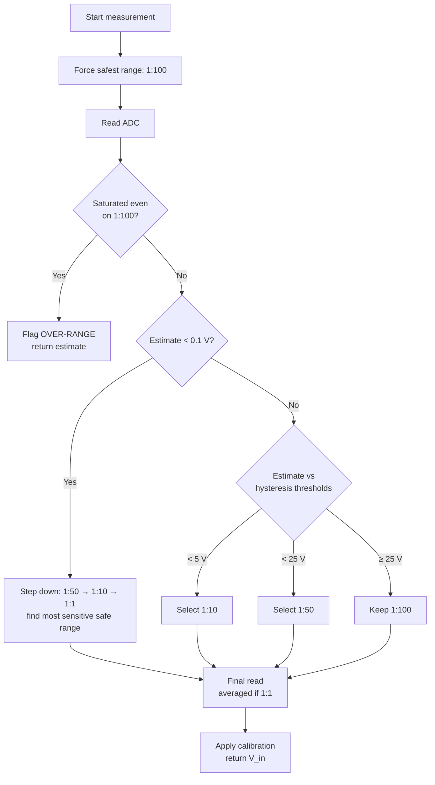

# ⚡ Industrial Auto-Ranging Digital Voltmeter

**Arduino UNO + ADS1115 (16-bit ADC) + CD4051 multiplexer + switchable resistive dividers**

> A multi-channel, auto-ranging digital voltmeter designed for industrial-style voltage
> measurement, built during a 2nd-year Electrical Engineering internship at
> **SAGEMCOM**, supervised by **M. Abdelkrim Ayari**, as part of the curriculum at
> **École Nationale d'Ingénieurs de Tunis (ENIT)** — 2024/2025.

---

## 📋 Table of Contents

- [Overview](#-overview)
- [Features](#-features)
- [Hardware](#-hardware)
- [How It Works](#-how-it-works)
- [Voltage Divider Design](#-voltage-divider-design)
- [Resolution Analysis](#-resolution-analysis)
- [Auto-Ranging Algorithm](#-auto-ranging-algorithm)
- [Repository Structure](#-repository-structure)
- [Getting Started](#-getting-started)
- [Calibration](#-calibration)
- [Known Limitations & Roadmap](#-known-limitations--roadmap)
- [Skills Demonstrated](#-skills-demonstrated)
- [Acknowledgments](#-acknowledgments)
- [License](#-license)

---

## 🔍 Overview

Accurately measuring electrical voltage is a core requirement in industrial monitoring,
control, and maintenance systems. This project implements a **digital voltmeter** capable
of measuring a wide range of voltages — from a few millivolts up to roughly 100 V — using
a single low-cost 16-bit ADC and a bank of switchable resistive dividers.

Instead of relying on one fixed attenuation factor (which forces a trade-off between
range and resolution), the firmware automatically selects the most sensitive divider
ratio that still keeps the signal within the ADC's safe input window — a technique known
as **auto-ranging**.

## ✨ Features

- 🎚️ **4 switchable measurement ranges**: 1:1, 1:10, 1:50, 1:100
- 🧠 **Automatic range selection** with hysteresis to avoid flicker at range boundaries
- 🔬 **16-bit resolution** via the ADS1115 (down to ~0.19 mV/LSB at ±6.144 V full scale)
- 🛡️ **Fail-safe startup**: the meter always powers up on the most protective (1:100) range
- ⚠️ **Saturation / over-range detection** flagged in the serial output
- 📈 **Averaged sampling** on the most sensitive range for better noise rejection at low
  voltages
- 🔌 **I²C interface**, easy to extend to a display, data logger, or Modbus/RS-485 gateway

## 🧰 Hardware

| Component | Role |
|---|---|
| **Arduino UNO** (ATmega328P) | Main controller — drives the multiplexer and reads the ADC over I²C |
| **ADS1115** | 16-bit I²C ADC with programmable gain amplifier (PGA), ±6.144 V to ±0.256 V full scale |
| **CD4051** | 8-channel analog multiplexer — routes the active divider output to the ADC input |
| **Resistive dividers** | 4 fixed ratios (1:1, 1:10, 1:50, 1:100), Rbas = 10 kΩ |
| **Protection network** | Series limiting resistors (sized against the ADS1115's 10 mA continuous / 100 mA momentary input current limit), clamp/TVS diodes, RC filtering, fuse |

Schematic captured in Proteus 8 (see `docs/schematic-notes.md`).

## 🖼️ Schematic


*Full circuit captured and simulated in Proteus 8 (`stage.pdsprj`): Arduino UNO driving
the ADS1115 over I²C, the CD4051 multiplexer selecting between the R1–R5 resistive
divider network, and a two-digit display for local readout.*

## ⚙️ How It Works

1. The input voltage passes through the currently selected resistive divider.
2. The CD4051 multiplexer routes that divider's output to the ADS1115 input.
3. The ADS1115 converts the attenuated voltage to a 16-bit digital value over I²C.
4. The Arduino reconstructs the real input voltage:

   ```
   V_ADC = counts × 0.1875 mV      (at PGA = ±6.144 V)
   V_in  = V_ADC × F                (F = divider factor: 1, 10, 50 or 100)
   ```

5. The system can extend to **8 channels** by using the remaining CD4051 inputs.

## 🧮 Voltage Divider Design

The divider ratio `F` relates the high-side resistor `R_haut` to the fixed low-side
resistor `R_bas`:

```
F = V_in / V_ADC = (R_haut + R_bas) / R_bas
R_haut = (F − 1) × R_bas
```

With `R_bas = 10 kΩ`:

| Ratio (F) | R_bas | R_haut | Notes |
|---|---|---|---|
| 1:1 | 10 kΩ | 0 Ω | Direct connection |
| 1:10 | 10 kΩ | 90 kΩ | |
| 1:50 | 10 kΩ | 490 kΩ | |
| 1:100 | 10 kΩ | 990 kΩ | |

## 📐 Resolution Analysis

The ADS1115's resolution depends on its programmable gain (PGA) setting:

```
ΔV_LSB = V_fs / 2^15        (16-bit signed conversion)
```

Example — measuring up to **100 V** with a 1:25 divider (Rbas = 10 kΩ, Rhaut ≈ 240 kΩ):

| PGA | ADC range | ADC resolution | Input resolution (F = 25) |
|---|---|---|---|
| ±4.096 V | 0 → 4.096 V | 0.125 mV | **3.125 mV** over 0–100 V |
| ±6.144 V | 0 → 6.144 V | 0.1875 mV | **4.69 mV** over 0–100 V |

`±4.096 V` gives the best resolution; `±6.144 V` trades a bit of resolution for extra
headroom above the nominal 100 V measurement range. This firmware uses `±6.144 V`
(`GAIN_TWOTHIRDS`) as a conservative default.

## 🔄 Auto-Ranging Algorithm



The firmware always probes on the **safest range first**, then narrows down — this
protects the ADC input from unexpected high voltages before committing to a more
sensitive (less attenuated) range.

## 📁 Repository Structure

```
industrial-voltmeter/
├── README.md                    # This file
├── LICENSE
├── src/
│   └── voltmeter/
│       └── voltmeter.ino        # Corrected, production-ready firmware
└── docs/
    └── schematic-notes.md       # Wiring reference & bill of materials
```

## 🚀 Getting Started

> Full ADS1115 datasheet cross-reference (absolute ratings, default I²C address, sample rate)
> is in [`docs/schematic-notes.md`](docs/schematic-notes.md).

### Requirements

- Arduino IDE (or PlatformIO)
- [`Adafruit_ADS1X15`](https://github.com/adafruit/Adafruit_ADS1X15) library
  (install via **Library Manager** → search "Adafruit ADS1X15")
- Arduino UNO, ADS1115 breakout, CD4051 breakout, and the resistor network described
  above

### Wiring summary

| Signal | Arduino UNO pin |
|---|---|
| I²C SDA | A4 |
| I²C SCL | A5 |
| CD4051 select S0 | D2 |
| CD4051 select S1 | D3 |
| CD4051 select S2 | D4 |

### Upload

```bash
git clone https://github.com/<your-username>/industrial-voltmeter.git
cd industrial-voltmeter/src/voltmeter
# Open voltmeter.ino in the Arduino IDE, select "Arduino UNO", and upload.
```

Open the Serial Monitor at **9600 baud** to see live readings, e.g.:

```
Voltage: 12.3456 V  (Range: 1:10)
```

## 🎯 Calibration

For best accuracy, measure a known reference voltage on each range and adjust the
constants near the top of `voltmeter.ino`:

```cpp
const float CAL_OFFSET_V = 0.0f;  // additive offset, in volts
const float CAL_GAIN     = 1.0f;  // multiplicative correction
```

## 🛣️ Known Limitations & Roadmap

- [ ] No galvanic isolation — do not use on mains-connected circuits without an
      isolated front end
- [ ] Only 4 of the CD4051's 8 channels are currently used — remaining channels can
      host additional measurement points
- [ ] Add an LCD/TFT display or Modbus/RS-485 output for standalone operation
- [ ] Automated multi-point calibration routine
- [ ] Enclosure design for field deployment

## 🧠 Skills Demonstrated

Circuit design & signal conditioning · resistive divider sizing · analog multiplexing ·
datasheet analysis · Proteus 8 schematic capture & simulation · Arduino/I²C firmware ·
auto-ranging measurement algorithms · embedded calibration techniques.

## 🙏 Acknowledgments

This project was carried out during an internship at **SAGEMCOM**, under the
supervision of **M. Abdelkrim Ayari**, as part of the 2nd-year Electrical Engineering
curriculum at **École Nationale d'Ingénieurs de Tunis (ENIT)**, 2024/2025.

## 📄 License

Released under the [MIT License](LICENSE) — feel free to reuse or adapt for your own
projects.
